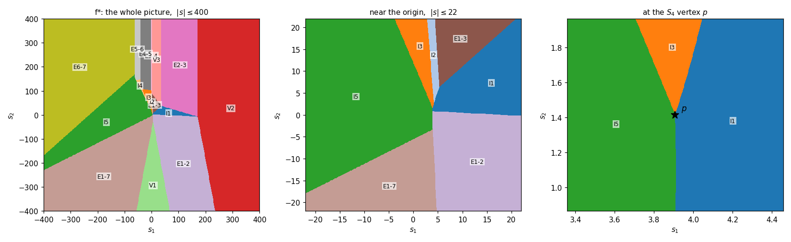

# The section-4 example's conjugate, computed — and what it does to the theorem

_Written 2026-08-21. Companion to `CONJ_FIELD_PROOF.md` §4 and §7.4b, which found the elliptical
edge and left two questions open: whether the fault is in the example or in the structure theorem
(§7.4b's closing paragraph), and what the minimum piece count is (§7.5). Both are answered here._

## Answer in one line

**The theorem is wrong, not the example** — and the example is stronger than it needs to be:
**three pieces** already refute [JOGO] Theorem 6 and Proposition 7, with no `S4` vertex and no
irrational arithmetic anywhere.

The break is one sentence in Theorem 6's proof and one in Step 3b's: both assume the two functions
compared in the maximum include a linear one, *because the pieces compared are adjacent in the
primal*. Nothing forces that once a PLQ function has three pieces.

Everything below is exact rational arithmetic except where a sampled figure is quoted.

---

## 1. Where the proof breaks

[JOGO] = Karmarkar & Lucet, *A linear-time algorithm to compute the conjugate of nonconvex
bivariate piecewise linear-quadratic functions*, J. Glob. Optim. **94** (2026) 3–34
(`reference/KARMARKAR-26-conjugate.pdf`).
[COAP] = *Computing the convex envelope of bivariate piecewise linear-quadratic functions in
linear time*, Comput. Optim. Appl. **94** (2026) 747–780
(`reference/KARMARKAR-26-convex-envelope.pdf`).

The claim under test is [JOGO]'s abstract: *"Finally we compute the maximum of all those functions
to obtain the conjugate as a piecewise quadratic function defined on a parabolic subdivision"*,
with a parabola defined (p. 6) by `b^2 - 4ac = 0` — the same condition `QuaPar.m` enforces on
`Ec`.

**Theorem 6** (*the maximum of two conjugates admits a parabolic subdivision*) is proved by:

> "In Step 2, only the rational functions restricted to an edge give rise to quadratic
> expressions. In Step 3, when we compare two functions we always get one of them as linear.
> Nonempty intersections are obtained only when the primal has a common edge. Hence the two
> functions we compare always have one linear function."

and **Step 3b** — the maximum *across* the pieces of `f` — rests on:

> "The pieces are adjacent to each other in the primal and Proposition 7 shows that we would get a
> parabolic subdivision as if we had considered both pieces together as one piece."

Three claims, two of them false.

* **"Only the rational functions give rise to quadratic expressions" is false.** A positive
  definite piece is its own convex envelope, so Step 1 produces no rational function at all — and
  its conjugate is quadratic anyway: `1/2 (s-beta)' Q^{-1} (s-beta)` on the cell `Q*T + beta`,
  plus a quadratic on each edge cell. That quadratic is **elliptic**:
  `b^2 - 4ac = -det(Q^{-1}) < 0`. All five pieces of §4.1 are positive definite, and every `I_k`
  face in section 3 below is such an expression. Proposition 4 itself is not wrong — it is about
  the quadratic arising from the *rational* form, and it never claimed to cover this one.

* **"The pieces are adjacent in the primal" is false.** Step 3b iterates the maximum over *all*
  pieces of `f`. With three or more pieces some compared pair is non-adjacent, and then *both*
  functions can be elliptic quadratics whose difference is a general conic.

* **The adjacent case is fine, and that is the whole story.** If two pieces share an edge,
  continuity forces `q1 - q2 = l*m` with `l` vanishing on it, and the conic `{g1 = g2}` comes out
  **degenerate** — a pair of straight lines, 3×3 determinant exactly `0`. That is `CONJ_FIELD_PROOF.md`
  Theorem 3, and it was re-checked here on six random exact continuous adjacent pairs (0
  non-degenerate) as well as on all four adjacent pairs of §4.1. Lines are parabolas, so the
  theorem's conclusion holds for every comparison its proof actually covers.

**[COAP] inherits the gap rather than repairing it.** Its section 4 opens *"Given a nonconvex PLQ
function, we compute the conjugate and obtain a piecewise parabolic function"*, and its equation
(1) defines a parabolic function by `a > 0, c > 0, b^2 - 4ac = 0`. Propositions 1, 3, 5, 8 and
Theorem 10 are all proved from that form. The conjugate pieces here do not have it — `I1` alone has
`b^2 - 4ac = -1/14` — so [COAP]'s *proof* does not reach this input either. Its conclusion (the
biconjugate is rational on a polyhedral subdivision) is **not** refuted here; only the route to it.
That is consistent with `CONJ_FIELD_PROOF.md` Theorem 4 and its corollary, which reach the same
conclusion without ever assuming a parabolic subdivision.

---

## 2. Three pieces are enough (answers §7.5)

§7.5 says the minimum piece count is not established and guesses four, reasoning that three
*pairwise* non-adjacent pieces are needed. Only **two** non-adjacent pieces are needed — a triple
point is required for the `S4` field result, not for the subdivision result — and three pieces give
two.

Delete pieces 4 and 5 of §4.1. What is left is the triangle `(0,0), (60,10), (-5,10)` cut by the
two cevians to `(15,10)` and `(5,10)`: a continuous three-piece PLQ, all three Hessians positive
definite, with pieces 1 and 3 separated by piece 2. On the horizontal segment from `(9/2, 3/2)` to
`(7/2, 3/2)`:

| `s` | piece 1 | piece 2 | piece 3 | maximiser |
|---|---|---|---|---|
| `(9/2, 3/2)` | **3.8035714286** | 3.2019230769 | 3.0667701863 | interior of `T1` |
| `s*` | **2.9278190688** | 2.8267080882 | **2.9278190688** | interior of `T1` *and* `T3` |
| `(7/2, 3/2)` | 2.3392857143 | 2.6691176471 | **2.8369565217** | interior of `T3` |

with

    s* = ( -17/62 + sqrt(612030)/186 , 3/2 )  ~=  (3.931846572656, 1.5)

Pieces 1 and 3 tie there and piece 2 is strictly below, so `f*` switches from `g1` to `g3` across
`{g1 = g3}`, which is

| curve | type | `b^2 - 4ac` | 3×3 det |
|---|---|---|---|
| `93 s1^2 + 38 s1 s2 - 6 s1 + 39 s2^2 - 482 s2 - 1003 = 0` | **ellipse** | `-13064` | `-8650208 != 0` |

Every number is a rational or the square root of a rational; §4.2's quartic plays no part. A
brute-force sup of `<s*,x> - f(x)` over the domain at about 8 million sampled points, using none
of the machinery above, returns `2.92778` — a lower bound, as a sampled sup must be, agreeing to five
digits.

So the smallest known refutation is **a continuous PLQ on a triangle with three positive definite
pieces**. §4's five-piece construction proves something harder and separate — that a *vertex* of
`f*` can be a degree-4 point with Galois group `S4` — which is a statement about the number field,
not about the subdivision, and which neither paper claims.

---

## 3. The conjugate of the five-piece example, displayed

`f*(s) = max_k sup_{x in T_k} <s,x> - q_k(x)`, with the `f`-rows in the raw-Hessian convention of
§4.1.

### 3.1 The merge: 35 cells, 23 formulas, 17 faces

Each piece contributes seven cells to its own conjugate — one where the unconstrained maximiser
lies inside the triangle, one per edge, one per vertex: 35 cells over the five pieces.

The edge and vertex formulas depend only on the **restriction** of `q` to that edge or vertex, and
adjacent pieces agree there because `f` is continuous. So cells of different pieces carry
*identical* formulas and the edges between them carry no information: the apex cell is `f* = 0` for
all five pieces at once, and each shared cevian and shared top vertex fuses a pair. 35 cells
collapse to **23 distinct formulas**.

Taking the maximum then drops six: the three inner cevians `E1-4, E1-5, E1-6` and the three inner
top vertices `V4, V5, V6` never win anywhere. **17 faces remain**, each connected.

### 3.2 The 17 faces

Mesh vertices numbered as in §4.1: `1 = (0,0)`, `2 = (60,10)`, `3 = (15,10)`, `4 = (5,10)`,
`5 = (-5,10)`, `6 = (-15,10)`, `7 = (-60,10)`.

| face | `f*(s)` | the maximiser sits |
|---|---|---|
| `I1` | `5 s1^2/28 + s1 s2/14 - s1/14 + 3 s2^2/28 - 3 s2/14 + 3/28` | inside `T1` |
| `I2` | `17 s1^2/52 + 5 s1 s2/26 - 31 s1/13 + 3 s2^2/52 - 3 s2/13 + 81/13` | inside `T2` |
| `I3` | `11 s1^2/322 + 2 s1 s2/161 - 10 s1/161 + 15 s2^2/322 + 86 s2/161 + 268/161` | inside `T3` |
| `I4` | `17 s1^2/230 - 2 s1 s2/115 - 142 s1/115 + 7 s2^2/230 + 37 s2/115 + 1247/230` | inside `T4` |
| `I5` | `35 s1^2/528 - s1 s2/24 - 175 s1/132 + s2^2/48 + 5 s2/12 + 875/132` | inside `T5` |
| `E1-2` | `18 s1^2/101 + 6 s1 s2/101 - 6 s1/101 + s2^2/202 - s2/101 + 1/202` | on the outer ray to `(60,10)` |
| `E1-3` | `9 s1^2/70 + 6 s1 s2/35 - 6 s1/35 + 2 s2^2/35 - 4 s2/35 + 2/35` | on cevian 1 — **both** neighbours at once |
| `E1-7` | `18 s1^2/299 - 6 s1 s2/299 - 360 s1/299 + s2^2/598 + 60 s2/299 + 1800/299` | on the outer ray to `(-60,10)` |
| `E2-3` | `s1^2/6 + 10 s1/3 + 10 s2 - 730/3` | on the top edge of `T1` |
| `E3-4` | `s1^2/6 + 44 s1/3 + 10 s2 - 1342/3` | on the top edge of `T2` |
| `E4-5` | `s1^2/30 + 6 s1/5 + 10 s2 - 2396/5` | on the top edge of `T3` |
| `E5-6` | `s1^2/14 - 4 s1 + 10 s2 - 764` | on the top edge of `T4` |
| `E6-7` | `s1^2/22 - 120 s1/11 + 10 s2 - 12050/11` | on the top edge of `T5` |
| `V1` | `0` | at the apex — all five pieces |
| `V2` | `60 s1 + 10 s2 - 5060` | at `(60,10)` |
| `V3` | `15 s1 + 10 s2 - 895/2` | at `(15,10)` — pieces 1 and 2 |
| `V7` | `-60 s1 + 10 s2 - 14350` | at `(-60,10)` |

`E1-3` is worth a second look: it is an **interior** cevian, and on that face pieces 1 and 2 attain
the same value at the same point of the shared edge — the kink there is concave, so the maximiser
cannot leave the edge on either side. That is the merge doing real work rather than tidying: one
face of `f*` spanning two primal pieces.

Left, the whole arrangement; middle, near the origin; right, the `S4` vertex
`p = (3.907778936..., 1.414595978...)`, where `I1`, `I3` and `I5` meet and nothing else does. The
angular widths there come out `162 / 37 / 161` on a 360-sample circle, against §4.3's
`162.55 / 36.32 / 161.13` — computed here without reading those numbers.

### 3.3 The edges

Between faces `u` and `v` the boundary lies on `{F_u - F_v = 0}`. Forty-four pairs of faces meet.
Three of them — `I1|V3`, `I2|V3`, `I5|V7` — touch at a **single point**, where the vertex face's
affine function is tangent to the interior quadratic; they are not edges. Of the 41 that are:

| kind | count | note |
|---|---|---|
| straight | **31** | 23 a repeated line, 8 a *pair* of lines (3×3 det `= 0`) |
| ellipse arc | **5** | non-degenerate, `b^2 - 4ac < 0` |
| hyperbola arc | **5** | non-degenerate, `b^2 - 4ac > 0` |
| parabola | **0** | not one |

"Straight" is not the same as "parabolic", but it is `QuaPar`-legal either way: each such edge lies
on a line, and a line is the all-zero degenerate `Ec` row. The 8 line-pairs are exactly the
adjacent-piece case of Theorem 3. **Not one of the 41 edges is a genuine parabola** — which is a
sharper statement than "the subdivision is not parabolic".

The ten curved edges, exactly:

| edge | type | `b^2 - 4ac` | equation |
|---|---|---|---|
| `I1 \| I3` | ellipse | `-71/2254` | `93 s1^2 + 38 s1 s2 - 6 s1 + 39 s2^2 - 482 s2 - 1003 = 0` |
| `I1 \| I5` | ellipse | `-2/77` | `415 s1^2 + 418 s1 s2 + 4636 s1 + 319 s2^2 - 2332 s2 - 24104 = 0` |
| `I3 \| I5` | hyperbola | `265/42504` | `-2731 s1^2 + 4598 s1 s2 + 107420 s1 + 2189 s2^2 + 9988 s2 - 421996 = 0` |
| `I4 \| V3` | ellipse | `-1/115` | `17 s1^2 - 4 s1 s2 - 3734 s1 + 7 s2^2 - 2226 s2 + 104172 = 0` |
| `E4-5 \| I4` | ellipse | `-8/1725` | `-28 s1^2 + 12 s1 s2 + 1680 s1 - 21 s2^2 + 6678 s2 - 334389 = 0` |
| `E4-5 \| I5` | ellipse | `-1/990` | `-87 s1^2 + 110 s1 s2 + 6668 s1 - 55 s2^2 + 25300 s2 - 1282588 = 0` |
| `E1-2 \| I5` | hyperbola | `7/404` | `5969 s1^2 + 5390 s1 s2 + 67532 s1 - 847 s2^2 - 22748 s2 - 353236 = 0` |
| `E1-3 \| I3` | hyperbola | `24/1127` | `152 s1^2 + 256 s1 s2 - 176 s1 + 17 s2^2 - 1044 s2 - 2588 = 0` |
| `E3-4 \| I3` | hyperbola | `4/161` | `128 s1^2 - 12 s1 s2 + 14228 s1 - 45 s2^2 + 9144 s2 - 433732 = 0` |
| `E5-6 \| I5` | hyperbola | `1/462` | `19 s1^2 + 154 s1 s2 - 9884 s1 - 77 s2^2 + 35420 s2 - 2848244 = 0` |

The first three are the pairs meeting at `p`; the 3×3 determinants of the *unscaled* differences
`g_i - g_j` are `-73/2254`, `-29/264`, `-3/7084` — §4.2's three values, recomputed here from the
primal data. (The equations above are those differences cleared to integers, so their own
determinants carry the cube of the clearing factor.) Note that seven
of the ten do **not** involve `p` at all: the curved edges are not a local curiosity at the triple
point.

---

## 4. What CCA2 does with it

Measured 2026-08-20/21 on this machine, MATLAB R2024b.

* **`conj('cplq')` returns nothing on either input.** Five pieces: ~35 min, then the Step 3
  cross-check `conjCPLQ>assertStep3MatchesPieces` fires — the assembled maximum returns `NaN` at
  `s = (-121,-121)` where the pointwise max of its own per-piece conjugates gives `739.506689`
  (which the independent oracle here confirms exactly). Three pieces: ~14 min, same failure, same
  point, per-piece max `0`. **That point is the first probe of the gate's own `11x11` grid**
  (half-width `2*max|V| + 1 = 121`), so both runs die at the far corner before reaching anything
  interesting. It is a coverage gap in the assembly and a **separate finding** from this document's
  subject.

* **This differs from `CONJ_FIELD_PROOF.md` §10**, which records the three-piece input dying at 69 s
  in `symbolicFunction.getDen` and the five-piece one at 8 s in
  `plq_1p.conjugateFunction:579` (`Unrecognized function or variable 'd'`). Neither reproduces
  here; both runs now get all the way to Step 3's gate. `region.m` and `exactQ.m` were under active
  edit in another session, so the most likely explanation is simply that the code moved. **Re-run
  before quoting either record.**

* **Driven past the gate, the pipeline is right.** Calling
  `quaPolToPlq -> triangulate -> maximum` directly on the three-piece input (434 s, no
  cross-check) assembles **21 pieces**, and:

  * `f*(s*) = 2.9278190688`, matching the oracle to every printed digit, in its piece 14 — and
    `1e-3` to the right it hands over to piece 21 at `2.9292591926`. The face boundary is exactly
    where the ellipse says it is.
  * its region inequalities are **83 linear and 26 quadratic, of which _zero_ satisfy
    `b^2 - 4ac = 0`** — 7 elliptic and 19 hyperbolic.
  * the witness ellipse is stored verbatim: pieces 13, 14, 20 and 21 are bounded by
    `s1^2 + 38 s1 s2/93 - 2 s1/31 + 13 s2^2/31 - 482 s2/93 - 1003/93 <= 0`, which is the curve of
    section 2 divided by 93.

So `cPLQ`'s `region` keeps general symbolic inequalities and carries a genuine conic without
complaint. **The algorithm is right; the theorem describing its output is not**, and the class that
encodes that theorem — `QuaPar`, whose `Ec` rows must satisfy `b^2 - 4ac = 0` — is what cannot hold
this object. Same for `clipArcByConic.m`'s header assumption that no ellipse or hyperbola can arise
as a dual boundary.

---

## 5. How this was checked

Every formula in section 3 was graded against an oracle sharing no code with it: for each piece,
the sup over the closed triangle by enumeration — the stationary point when it lies inside,
otherwise each closed edge as a 1-D concave quadratic, clamped, plus the vertices. Strict convexity
of each `q_k` makes the enumeration exact.

* 100 000 sample points across five scales (`|s| <= 3` to `|s| <= 4000`):
  **max |formula - enumeration| = 2.9e-11**, and exactly 17 distinct faces appear.
* §4.2's certificate reproduced from the primal data: the three equal values at `p`, their
  argmaxes, the two dominated pieces, the three 3×3 determinants, and the three angular widths.
* Continuity of `f` across all four cevians: exactly `0`.
* Adjacent-pair degeneracy (Theorem 3) re-checked on six random exact continuous pairs: 0
  non-degenerate.

Two corrections made along the way, both recorded because either would have been quotable:

* an earlier draft of this note said "21 of 44 edges are ellipse or hyperbola arcs". That counted
  every conic with `b^2 - 4ac != 0`, including the **degenerate** ones — line pairs, which are
  straight edges and perfectly `QuaPar`-legal. The correct count is the table in section 3.3: 10
  curved edges out of 41.
* the `f`-rows were entered in the raw-Hessian convention (`[Q11 Q12 Q22 beta1 beta2 gamma]`),
  which is what `QuaPol.evalPoly`'s weights mean. §4.1 now carries the same convention; the
  monomial reading halves the two diagonal entries and encodes a different function. Both readings
  happen to have the same triple point (the `g_k` all scale by 2), so this note's conclusion is
  unaffected either way — but the numbers here are the raw-Hessian ones.

Nothing in the repository was modified apart from this file and its figure; no test bucket was run.

---

_Source: the same material is published as an artifact at_
<https://claude.ai/code/artifact/2f47a47c-6496-4e6c-98a6-902417659ccd>.
